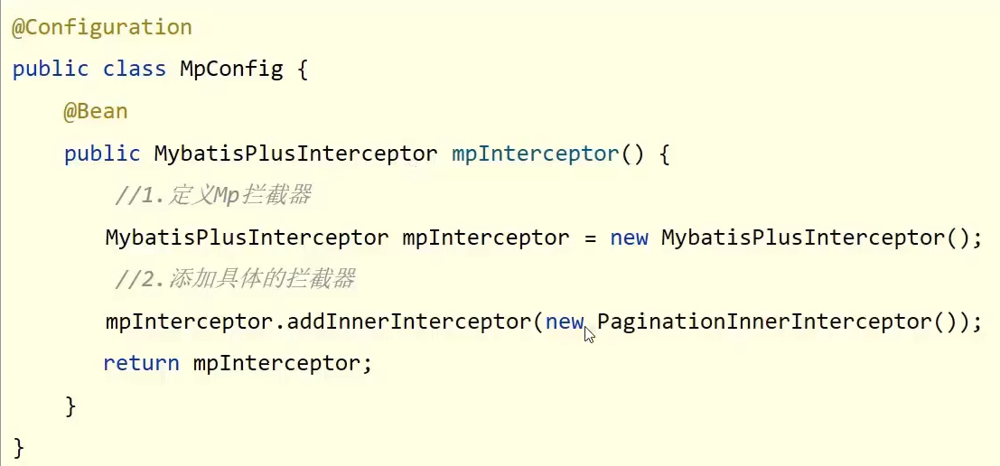

parent : 里面定义了若干个依赖管理，使用maven导包时可以直接找到最稳定的版本

starter : 定义了当前项目使用的所有依赖坐标，以达到减少依赖配置的目的 

引导类 : Boot工程的执行入口，运行main方法就可以启动项目, SpringBoot工程运行后初始化Spring容器，扫描引导类所在包加载bean

内置服务器

tomcat(默认)   

jetty 轻量级

undertow 负载性能勉强跑赢tomcat

SpringBoot默认配置文件application.properties

修改服务器端口  server.port=80

日志 

logging.level.root=

info(默认)  

debug(全部) 

error(报错)

SpringBoot:提供了3种配置文件的格式
	properties(传统格式/默认格式)
	yml（主流格式）
	yaml

SpringBoot配置文件加载顺序
application.properties>application.yml>application.yaml

SpringBoot整合JUnit

1.导入测试对应的starter
2.测试类使用@SpringBootTest修饰
3.使用自动装配的形式添加要测试的对象

SpringBoot整合MyBatis

在数据层上方加入@Mapper

SpringBoot整合MyBatisPlus

见springboot_08_ssmp代码

想使用分页功能需要添加拦截器

作为springmvc的异常处理器：ProjectExceptionAdvice

@RestControllerAdvice = @ControllerAdvice + @ResponseBody

运维实用篇

工程打包与运行

1, SpringBoot工程可以基于java环境下独立运行jar文件启动服务
2, SpringB00t工程执行mvn命令package进行打包
3,执行jar命令:java -jar 工程名.jar

临时属性（比如端口需要改变）

args可以是临时属性的设置

配置文件可以配置多个，每级人员负责自己哪一个——————SpringBoot2第59集

多环境开发区分——————SpringBoot2第61集

关于日志	63-66